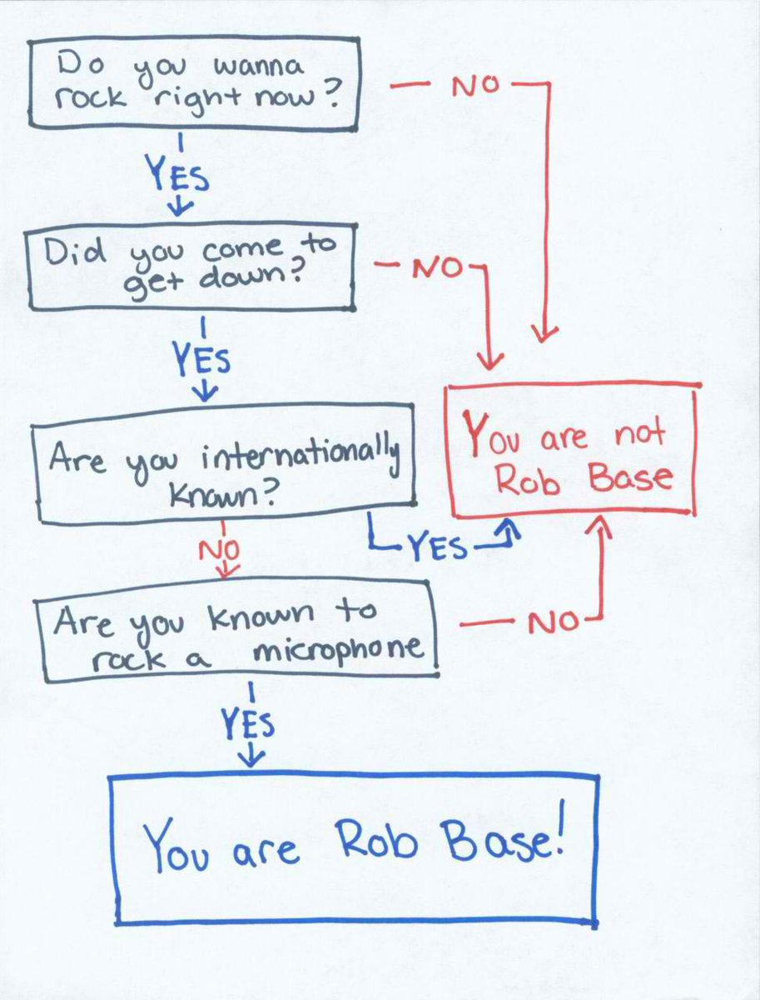

# Are you Rob Base?

As part of a bigger project I started thinking about how I might create an application that had a decision tree in it. This is nothing new and has done before but I needed a way to do this in Vue. At some point I came across this flow chart titled "Are you Rob Base?".

https://www.youtube.com/embed/phOW-CZJWT0

I thought this would be a great opportunity to try and create a small decision tree with questions from that flow chart and that is how this silly project came to be.
